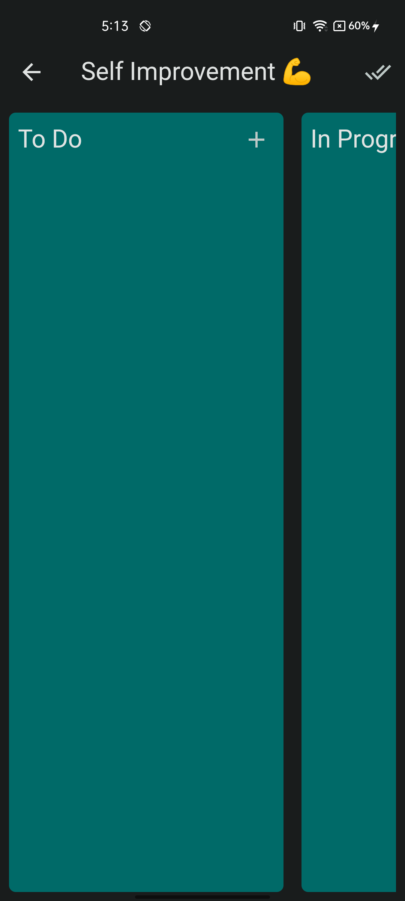
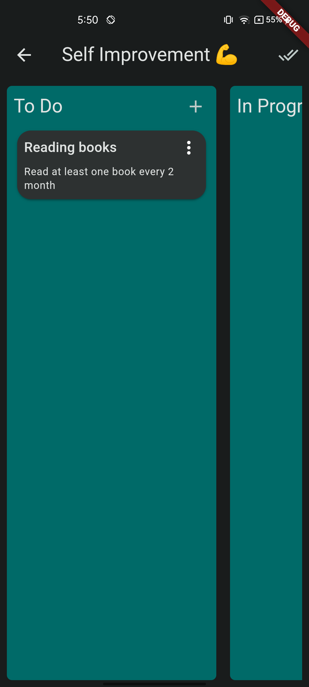

  
  
  
  
  
  
  
  
  
  
  
  
  
  
  
  
  

---

## Getting Started

### Prerequisites

- Flutter 3.19.6
- Java 11
- Xcode 15.2.0
- Vscode or android studio with flutter and dart extensions installed

### Installation

If you're new to Flutter the first thing you'll need is to follow the [setup instructions](https://docs.flutter.dev/get-started/install).

### Debug Builds

- Use `flutter run -d DEVICE_ID` to deploy a test build
To get a list of available `DEVICE_ID`, use `flutter run`.
- Typical values are: `windows`, `linux`, `macos`, `chrome`.
- Add `--release` to deploy an optimized build.

**Note:**

If you want to add your Todoist `apiKey` pass it as compile time constant for ex:
`flutter run --dart-define "apiKey={APIKEY}"`

Or you can change in `lib/config/constants.dart` file

### Release Builds

- Use `flutter build PACKAGE_TYPE` to build a release package.
- To get a list of available `PACKAGE_TYPE`, use `flutter build`.
- Typical values are `windows`, `linux` ,`apk` , `ios`.

## Demo build

- Web : https://innoscripta.codemagic.app

## Supported platforms

- [x] Web
- [x] IOS
- [x] Android
- [ ] Mac [Not Tested]
- [ ] Windows [Not Tested]
- [ ] Linux [Not Tested]

## App Features

- [x] Kanban board for tasks, where users can create, edit, and move tasks between different columns.
- [x] A timer function that allows users to start and stop tracking the time spent on each task. **⚠️ Local Only ⚠️** 
- [x] A history of completed tasks, including the time spent on each task and the date it was completed.
- [x] Customizable themes: Allow users to customize the look and feel of the app by choosing from a selection of pre-defined color schemes.

## CI/CD

Thanks to Codemagic, Whenever a tagged commit is made to the main branch, Codemagic initiates a pipeline that produces a fresh android release. Additionally, it updates the web app in the process.
